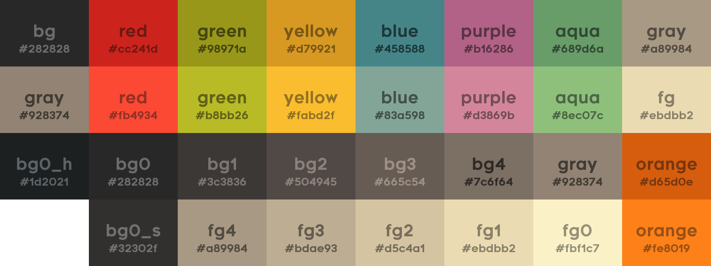

# Information:

Creates a palette preview image by using an easy-to-use config file   
Based on the great [gruvbox](https://github.com/morhetz/gruvbox) theme, where even the preview is impressive

# Usage:
You need **Python** with **pillow** module installed
1. Open up [pallete.py](palette.py) and set up the colors how you want (instruction in the file)  
2. Run either of the Python files to generate a palette
3. by default you will find your PNG in result.png

Simple as can be!

# Changelog:
Version 9 - moved the classes to main, that third file really was unnecessary (no image)

Archive of past results - to laugh or cry:  
[Version 8](version8.png) - changed hex to uppercase, file name to save into is a setting now  
[Version 7](version7.png) - added little corner descriptions as in gruvbox, repositioned text a bit  
[Version 6](version6.png) - the rewrite update, the project is rewritten from scratch to fix any bugs and improve usability    
Version 5 - the README update, finally added the Usage section (no image)  
[Version 4](version4.png) - the little darker strip at the bottom goes a long way in making this look good  
[Version 3](version3.png) - finally fixed the font, arial was making me angry, had to fix contrast again  
[Version 2](version2.png) - made in a day, got text contrast to about where I want it  
[Version 1](version1.png) - made in an hour, quality confirms it :p
